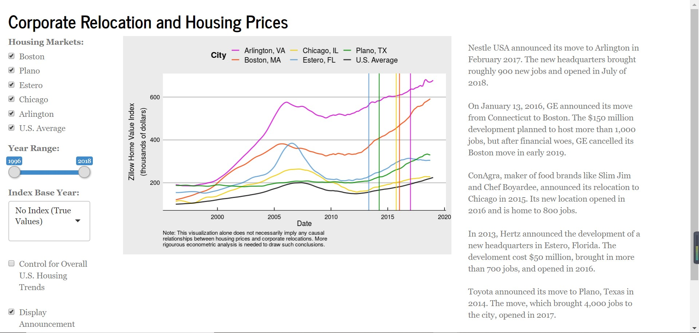
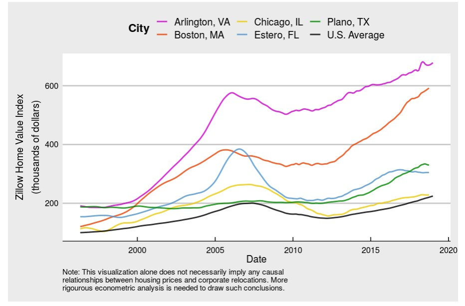
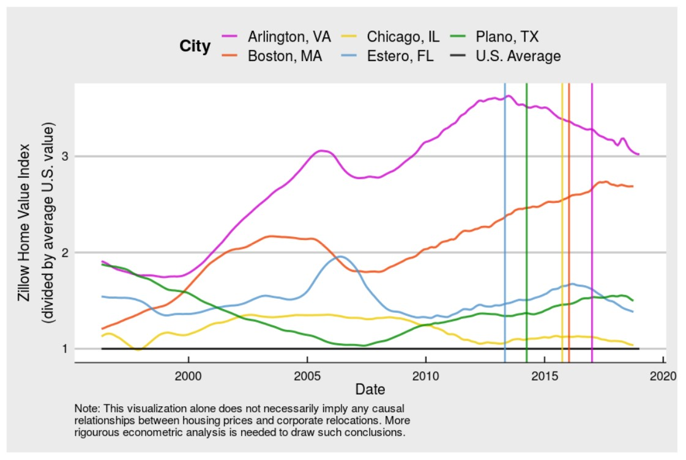

```{r setup, include=FALSE}
knitr::opts_chunk$set(echo = FALSE)
```

## Background


## Background


## Problem Statement

Hypothesis:

Both the announcement of a corporate headquarter relocation and the opening of the new development will result in a noticeable increase in local housing prices.  

## Approach

Data visualization: Shiny

- Examined median housing value data
- Identify 3-5 companies that are relevant for our work 

## Methods

Aim:give users a tool to analyze trends relating to corporate moves and make that conclusion for themselves.

Methods:

- API (Quandl)

- Shiny (interactive visualization)

## Results

Successfully created a tool that gives users the ability to examine the relationship between the corporate relocations and housing value trends.

[ProjectApp](https://ben-monticello.shinyapps.io/ProjectApp/)


## Results
(1)All selected cities have higher median housing values in true value than the U.S. average - with Chicago, IL  nearest to the U.S. average and Arlington, VA with the greatest difference from the average value.



## Results
(2)Regional housing value stays consistent in its market trajectory regardless of corporate relocations with cities like Boston and Plano largely moving in an upward direction and Arlington and Chicago and Estero for the most part moving in a negative direction.


## Results
(3)Many cities across the U.S. are compounded with the opportunities of an expanding labor market but challenged with a housing market that’s becoming less accessible for those seeking opportunities. 

                                      


